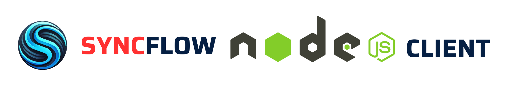

# SyncFlow Node Client
<p align="center">
  <a href="https://github.com/oele-isis-vanderbilt/syncflow-node-client.git"></a>
</p>
<p align="center">
    <em>Reusable NodeJS client implementation for SyncFlow.</em>
</p>
<p align="center">
<a href="https://github.com/oele-isis-vanderbilt/syncflow-node-client/actions/workflows/test.yaml" target="_blank">
    
</a>
</p>
This is a reusable NodeJS client implementation for SyncFlow. The idea here is to create necessary functionality to interact with the `SyncFlow` api, in a NodeJS application. Primary beneficiaries of this package could be clients to SyncFlow, who have their own backend in NodeJS and want to integrate with `SyncFlow`.

## Features
- Manage rooms, participants and recordings in the room
- Easy integration with existing Node.js applications

## Installation
Installation can be done via npm:

```sh
$ npm install syncflow-node-client
```

## Usage
In order to use the SyncFlow node client, you need the `SYNCFLOW_API_KEY`, `SYNCFLOW_API_SECRET` and `SYNCFLOW_SERVER_URL`. At this point, the server url is always going to be `https://api.syncflow.live`. To generate a key secret pair, login to `https://dashboard.syncflow.live`, navigate to settings page and use API keys generation page to generate the keys. Once, you have your api keys, either set the afore mentioned values as environment variables, or use directly with the `SyncFlowClientBuilder`.

```js
const {SyncFlowClientBuilder} = require('syncflow-node-client');

// Create a new client or set the environment variables SYNCFLOW_API_KEY, SYNCFLOW_API_SECRET and SYNCFLOW_SERVER_URL
const client = new SyncFlowClientBuilder()
                    .setApiKey('YOUR_API_KEY')
                    .setApiSecret('YOUR_API_SECRET')
                    .setServerUrl('SYNCFLOW_SERVER_URL').build();

// Now you can use the client to interact with SyncFlow API
// Generate User Token, results are returned as monads (Ok(RoomResult) or Err(HttpError))
const userTokenResults = await client.generateLivekitToken('NAME', {
    room: 'ROOM_ID',
});

// Create a room
const room = await client.createRoom('ROOM_NAME', {
    maxParticipants: 10,
    emptyTimeout: 60,
});
```

ToDO: Explore the API documentation for more details on the available methods and their usage. Further usage examples can also be found in the test [file](./src/syncflow-client.test.ts).

## API Reference
See the [doc file](./doc.md) for more details.

## License
[Apache 2.0](./LICENSE)

## Funding Information
This work is supported by the National Science Foundation under Grant No. DRL-2112635.
